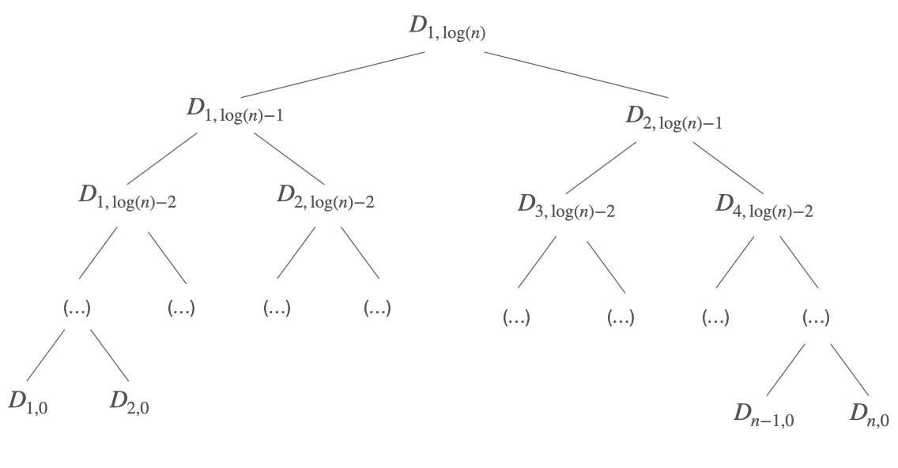

# Range Queries using Count-Min Sketch

## Overview

RangeQ_CMS is a Python implementation of the algorithm described in [(Cormode and Muthukrishan 2005)](https://github.com/AMendezCarmona/RangeQ_CMS#references), that provides a method for the obtention of estimated Range Queries using Count-Min Sketch and Dyadic Intervals.

This method becomes useful with huge datasets where it is difficult (or even impossible) to store them in local memory, making the obtantion of basic statistics practically prohibitive.


## Count-Min Sketch

Probabilistic data structure described in [(Cormode and Muthukrishan 2005)](https://github.com/AMendezCarmona/RangeQ_CMS#references) intended for storing a sublinear approximation of a given set. This method receives elements in a stream and can estimate the frequency of any element within a margin of error.

The data stucture consist of a two-dimensional $m \times p$. Given $\epsilon$ and $\delta$, CMS guarantees an estimation error within an additive error of $\epsilon$ with probability $\delta$. The dimension of the sketch can be then determined as $p = \lceil \ln(1/\delta) \rceil$ and $m = \lceil e/\epsilon \rceil$.

For a more detailed description of the data structure and its methods, see [(Cormode and Muthukrishan 2005)](https://github.com/AMendezCarmona/RangeQ_CMS#references).

## Range Queries using CMS

A range query computes the sum of the frequencies for all the elements between and interval $\[l,r\]$. A naive approach to answer this type of query would be to make a point query for all elements using a CMS, i.e. obtaining a frequency estimation for each one of the elements included in the interval and then suming them up, but this way the estimation error would increase linearly with the size of the interval. A concrete procedure for range queries was described in [(Cormode and Muthukrishan 2005)](https://github.com/AMendezCarmona/RangeQ_CMS#references) that intended to solve this problem.

### Dyadic Intervals and Dyadic Trees

Given $x \in \mathbb{N}$ and $y \in \mathbb{N}_0$, a dyadic interval is defined as:

$$ D_{x,y} = [(x-1)2^y+1, \, x2^y] $$

Given an interval $[1,n]$, where $n$ is a power of 2, we can construct a binary tree with all the dyadic intervals contained in $[1,n]$ as follows:



Using this dyadic tree, for any given interval $[l,r], \; 1 \leq l \leq r \leq n$, we can obtain the minimum cardinality dyadic cover, which would be of cardinality at most $2\log (n)$.


### Dyadic Trees and Count-Min Sketch

Given the dyadic tree built upon an interval $[1,n]$, the data structure for answering range queries using dyadic intervals uses $\log (n)+1$ sketches, one for each height of the dyadic tree. In short, for each interval $D_{x,y} \in C$, where $C$ refers to the minimum cardinality dyadic cover of an interval $[l,r]$, element $x$ is added to the sketch associated to height $y$ in the dyadic tree. To obtain the frequency estimation of all elements in an interval $[l,r]$, at most $2\log (n)$ point queries will be made, corresponding to the cardinality of the minimum cardinality dyadic cover of the queried interval. A much more detailed explanation of the procedure can be found in [(Cormode and Muthukrishan 2005)](https://github.com/AMendezCarmona/RangeQ_CMS#references).

## Example of use

```pycon
>>> from rangeqcms import *
>>> dt = DyadicTree(16, epsilon = 0.05, delta = 0.01)
>>> for i in range(1, 17):
...     dt.add(i)
... 
>>> dt.range_query(1,16)
16.0
>>> dt.range_query(2,12)
11.0
>>> dt.range_query(8,9)
2.0
>>> dt.range_query(13,13)
1.0
```


## References

<blockquote> Cormode, Graham, and Shan Muthukrishnan. "An improved data stream summary: the count-min sketch and its applications." Journal of Algorithms 55, no. 1 (2005): 58-75. </blockquote>